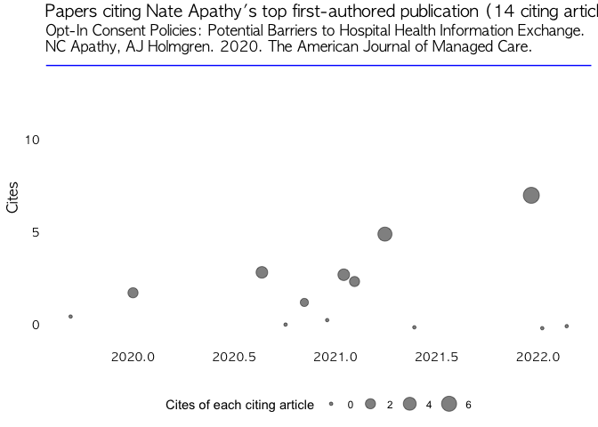
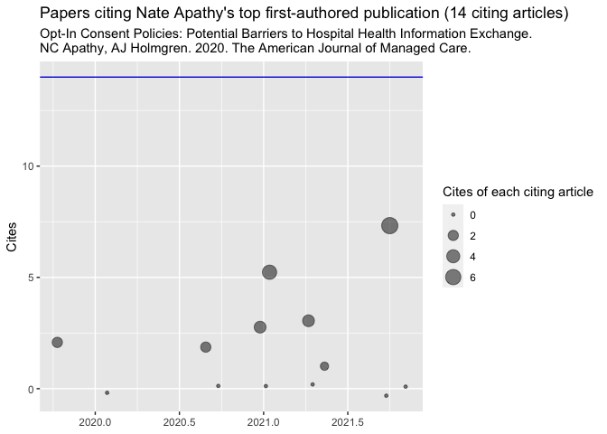

# Nate’s Miscellaneous Functions

Hi, I’m [Nate C. Apathy, PhD](https://www.nateapathy.com). I do health
services and health policy research focused on health information
technology. This is an R package that holds a bunch of miscellaneous
functions that I use in my research, or have just built for fun.

## Installing this package

This package isn’t on CRAN, so you’ll have to install it via `devtools`

``` r
devtools::install_github("nateapathy/ncaMisc")
```

## `get_gs_cite_data()`

This is a function that collects a bunch of data from a [Google
Scholar](https://scholar.google.com/) profile, including data on all of
the studies that cite a given scholar’s most-cited first-authored
publication. It has one argument: `id = "SCHOLARID"`. The SCHOLARID
value is the value in the URL of a given scholar’s profile following the
`user=` in the URL. For example, my SCHOLARID is `"DpaI7XMAAAAJ"` from
the URL of my profile:
`https://scholar.google.com/citations?user=DpaI7XMAAAAJ&hl=en`. All you
pass to this function is the id in quotes, and it returns a list of
information including information about the scholar, all of their
publications, and citations of their top-cited first-authored work.

``` r
nca_gs <- get_gs_cite_data(id="DpaI7XMAAAAJ")

str(nca_gs)
```

    ## List of 8
    ##  $ scholar_dat         :List of 10
    ##   ..$ id         : chr "DpaI7XMAAAAJ"
    ##   ..$ name       : chr "Nate Apathy"
    ##   ..$ affiliation: chr "Postdoctoral Fellow, University of Pennsylvania"
    ##   ..$ total_cites: num 134
    ##   ..$ h_index    : num 8
    ##   ..$ i10_index  : num 6
    ##   ..$ fields     : chr "verified email at pennmedicine.upenn.edu - homepage"
    ##   ..$ homepage   : chr "http://www.nateapathy.com/"
    ##   ..$ interests  : chr [1:4] "Health Services Research" "Health IT" "Informatics" "Health Policy"
    ##   ..$ coauthors  : chr [1:20] "A Jay Holmgren" "Christopher A Harle, PhD" "Julia Adler-Milstein" "Joshua R Vest, PhD, MPH" ...
    ##  $ pubs                :'data.frame':    32 obs. of  10 variables:
    ##   ..$ title       : chr [1:32] "Barriers to hospital electronic public health reporting and implications for the COVID-19 pandemic" "Opt-In Consent Policies: Potential Barriers to Hospital Health Information Exchange" "Trends and gaps in awareness of direct-to-consumer genetic tests from 2007 to 2014" "A decade post-HITECH: Critical access hospitals have electronic health records but struggle to keep up with oth"| __truncated__ ...
    ##   ..$ author      : chr [1:32] "AJ Holmgren, NC Apathy, J Adler-Milstein" "NC Apathy, AJ Holmgren" "NC Apathy, T Menser, LM Keeran, EW Ford, CA Harle, TR Huerta" "NC Apathy, AJ Holmgren, J Adler-Milstein" ...
    ##   ..$ journal     : chr [1:32] "Journal of the American Medical Informatics Association" "The American Journal of Managed Care" "American journal of preventive medicine" "Journal of the American Medical Informatics Association" ...
    ##   ..$ number      : chr [1:32] "27 (8), 1306-1309" "" "54 (6), 806-813" "28 (9), 1947-1954" ...
    ##   ..$ cites       : num [1:32] 26 14 12 10 10 10 9 8 8 6 ...
    ##   ..$ year        : num [1:32] 2020 2020 2018 2021 2021 ...
    ##   ..$ cid         : chr [1:32] "16200820819106237216" "4949578976304386628" "3139719257396025812" "13306797576420926985" ...
    ##   ..$ pubid       : chr [1:32] "ufrVoPGSRksC" "WF5omc3nYNoC" "qjMakFHDy7sC" "aqlVkmm33-oC" ...
    ##   ..$ first_author: chr [1:32] "AJ Holmgren" "NC Apathy" "NC Apathy" "NC Apathy" ...
    ##   ..$ lead_flag   : num [1:32] 0 1 1 1 0 1 0 0 0 0 ...
    ##  $ pct_first           : num 39.6
    ##  $ top_cid             : chr "4949578976304386628"
    ##  $ cites_of_top_cid    : num 14
    ##  $ urls                : chr [1:2] "https://scholar.google.com/scholar?start=0&hl=en&as_sdt=5,39&sciodt=0,39&cites=4949578976304386628&scipsc=" "https://scholar.google.com/scholar?start=10&hl=en&as_sdt=5,39&sciodt=0,39&cites=4949578976304386628&scipsc="
    ##  $ citing_articles_html:List of 2
    ##   ..$ :List of 2
    ##   .. ..$ node:<externalptr> 
    ##   .. ..$ doc :<externalptr> 
    ##   .. ..- attr(*, "class")= chr [1:2] "xml_document" "xml_node"
    ##   ..$ :List of 2
    ##   .. ..$ node:<externalptr> 
    ##   .. ..$ doc :<externalptr> 
    ##   .. ..- attr(*, "class")= chr [1:2] "xml_document" "xml_node"
    ##  $ citing_article_data :'data.frame':    13 obs. of  5 variables:
    ##   ..$ title  : chr [1:13] "Identifying Opportunities to Strengthen the Public Health Informatics Infrastructure: Exploring Hospitals' Chal"| __truncated__ "Removing barriers for digital health through organizing ambidexterity in hospitals" "Unfulfilled promises of health information exchange: What inhibits ambulatory clinics from electronically shari"| __truncated__ "Practice and market factors associated with provider volume of health information exchange" ...
    ##   ..$ scrape : chr [1:13] "DM Walker, VA Yeager, J Lawrence… - The Milbank …, 2021 - Wiley Online Library" "A Gleiss, S Lewandowski - Journal of Public Health, 2022 - Springer" "R Chandrasekaran, B Sankaranarayanan… - International Journal of …, 2021 - Elsevier" "NC Apathy, JR Vest, J Adler-Milstein… - Journal of the …, 2021 - academic.oup.com" ...
    ##   ..$ authors: chr [1:13] "DM Walker, VA Yeager, J Lawrence" "A Gleiss, S Lewandowski" "R Chandrasekaran, B Sankaranarayanan" "NC Apathy, JR Vest, J Adler-Milstein" ...
    ##   ..$ yr     : num [1:13] 2021 2022 2021 2021 2020 ...
    ##   ..$ cites  : num [1:13] 5 7 3 3 2 2 1 0 0 0 ...

So what? What can we do with this data? Well, the main goal I had was to
be able to visualize the “influence” of a scholar’s top-cited
first-authored publication. This gives us a sense of what additional
science that work has enabled. Eventually we can build this into layers
of a network where each citing article then has its own forward-citation
network. Maybe someday I’ll add an option for how many citation layers
you want and then build an animation to show that. But for now, we’re
just going to focus on the single layer.

``` r
# first get a few bits of metadata 
plotmet <- nca_gs$pubs %>%
  filter(cid==nca_gs$top_cid)

# now create the "influence plot"
nca_gs$citing_article_data %>%
  ggplot(aes(x=yr,y=cites,size=cites)) +
  geom_hline(yintercept = nca_gs$cites_of_top_cid,color="blue") +
  geom_jitter(alpha=0.5) +
  labs(title=paste0("Papers citing ",nca_gs$scholar_dat$name,
                    "'s top first-authored publication",
                    " (",plotmet$cites,
                       " citing articles)"),
       subtitle=paste0(plotmet$title,".",
                       "\n",plotmet$author,
                       ". ",plotmet$year,
                       ". ",plotmet$journal,"."),
       size="Cites of each citing article",
       x=NULL,y="Cites") -> p

p + theme_nca()
```

<!-- -->

## `theme_nca()`

This is a minimally customized `ggplot2` theme that changes the font to
Apple Gothic, strips the grid lines and background, changes a few font
sizes, and sticks the legend at the bottom. I built this so I don’t have
to constantly change these things with every plot I make. For example,
here’s the plot above but using the default `ggplot2` theme,
`theme_gray()`.

``` r
p
```

<!-- -->

Not **that** different, but just a little more pleasant to look at.
